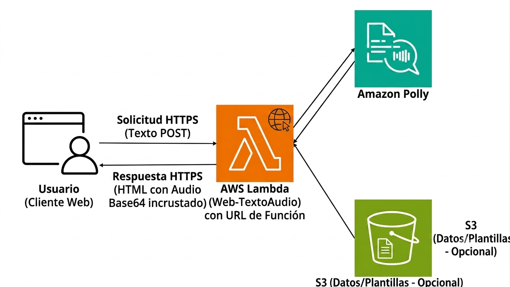

# Serverless Text-to-Speech API ☁️🎙️

Una aplicación web Serverless alojada en AWS que convierte texto a voz utilizando Inteligencia Artificial. Diseñada con una arquitectura síncrona orientada a la eficiencia y el bajo costo.

# Arquitectura y Tecnologías

*   **AWS Lambda:** Actúa como el backend de cómputo (Serverless), ejecutando el código Python solo cuando se recibe una petición HTTP.
*   **Lambda Function URLs:** Expone la función de forma segura a internet sin necesidad de aprovisionar un API Gateway, reduciendo costos y complejidad.
*   **Amazon Polly:** Servicio de IA de AWS que sintetiza el texto a voz (VoiceId: Lupe) de forma dinámica.
*   **Python (Boto3):** Orquestación del backend y comunicación con la API de AWS usando roles IAM (Zero Trust Security).
*   **HTML/CSS:** Interfaz de usuario renderizada directamente desde la función Lambda.

## Seguridad
*   **Principio de Menor Privilegio (IAM):** La función Lambda utiliza un rol de ejecución estrictamente limitado a los permisos de `polly:SynthesizeSpeech`. No hay credenciales hardcodeadas en el código.
*   **Capa de Autenticación Ligera:** Implementación de un PIN de seguridad desde el frontend para evitar el abuso de la URL pública y controlar los costos (Free Tier protection).

## Cómo funciona
1. El usuario ingresa a la URL pública generada por AWS Lambda.
2. El servidor responde con una interfaz web (GET request).
3. El usuario envía el texto y el PIN de seguridad (POST request).
4. Lambda valida las credenciales; si son correctas, se comunica con Amazon Polly.
5. Polly devuelve el stream de audio, el cual es codificado en base64.
6. Lambda devuelve el HTML actualizado con el reproductor de audio incrustado.
